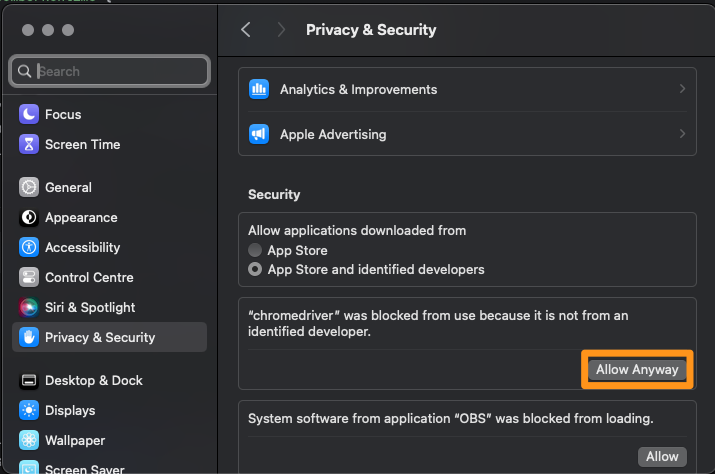

# Mimicking Cypress Commands With Selenium Java And Cucumber 

This is a test project to see if the commands of scaffolded Cypress project, which can be generated by running these steps here (https://docs.cypress.io/guides/getting-started/opening-the-app), can be mimicked by Selenium

## Downloading Various drivers
FYI： this section is under update, as for now I've only tested on Chromedriver and on MAC.

### Chromedriver (MAC)
1) Make sure you have `homebrew installed` (details are here: https://docs.brew.sh/Installation)
2) Run

```
brew install --cask chromedriver
```
3) Open up preferences > Privacy & Security, and scroll down and enable chromedriver here:



If you don't you will see this error when attempting to run the tests with the commands below:

```
“chromedriver” can’t be opened because Apple cannot check it for malicious software.
```

## Build
```
./gradle build
```

## Run all tests
```
./gradlew test
```
OR

```
./gradlew cucumberCli
```
